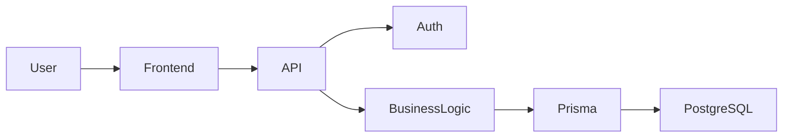
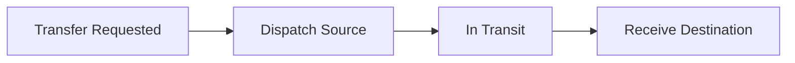

# Fundsroom Mini Operations ERP

A streamlined, modern full-stack Enterprise Resource Planning (ERP) case study designed to manage multi-warehouse inventory, customer order fulfillment, production work orders, and internal stock transfers. Built with a focus on inventory accuracy, strict reservation mathematics, and robust role-based operational workflows.


## Overview

Manufacturing and distribution businesses often suffer from a disconnect between sales commitments and warehouse reality. When sales representatives sell stock that isn't physically available, it leads to fulfillment delays. Similarly, when production floors run out of materials, work orders stall. 

The Mini Operations ERP solves this by enforcing a strict physical vs. reserved inventory model and offering a transparent internal transfer mechanism to resolve stock shortages. It provides a unified, real-time view of inventory levels, committed stock, internal stock movements, and manufacturing shortages for operations teams and sales representatives.

## Key Features

| Feature | Description |
|---|---|
| **Authentication** | Secure JWT-based login system for all staff. |
| **Role-Based Access Control** | Distinct permission models for Admin, Operations, and Sales roles. |
| **Inventory Management** | Track physical and available stock quantities across multiple locations. |
| **Customer Orders** | Empower sales teams to create orders that safely reserve inventory for fulfillment. |
| **Work Orders** | Manage production tasks, assign them to operators, and calculate material shortages. |
| **Internal Transfers** | Multi-step auditable movement of stock between different warehouse locations (Dispatch & Receive). |
| **Warehouse Management** | Support for multiple physical warehouses/locations. |
| **Stock Reservations** | Strictly prevent overselling by tracking committed stock against physical stock. |
| **Audit History** | Immutable transaction ledger recording every stock movement and reservation. |
| **Reusable UI Architecture** | Highly consistent, responsive frontend utilizing a centralized Modal architecture. |

## Technology Stack

| Layer | Technology |
|---|---|
| **Frontend** | React 18, Vite, TypeScript, Custom CSS |
| **Backend** | Node.js, Express, TypeScript |
| **Database** | PostgreSQL |
| **ORM** | Prisma |
| **Authentication** | JWT, bcryptjs |
| **Testing** | Vitest, Supertest |

## System Architecture

The application follows a standard client-server architecture with a strict boundary between frontend presentation and backend business logic.



## Core Workflows

### Customer Order Workflow

Sales users create orders that safely lock down inventory for customer fulfillment.


### Internal Transfer Workflow

Moving stock between facilities is a multi-step process ensuring goods aren't lost in transit.



### Work Order Workflow

Production directives tracking material shortages.


### Inventory Workflow

The system strictly differentiates between physical assets and business commitments.

`Available Stock = Physical Stock - Reserved Stock`

* **Physical Stock**: Actual boxes sitting in the warehouse.
* **Reserved Stock**: Committed to confirmed customer orders.
* **Available Stock**: Free to be sold or transferred.

## Role-Based Access Control

The system employs strict Role-Based Access Control enforced at both the UI (route guarding) and the API level (JWT middleware checks).

| Capability | `ADMIN` | `OPERATIONS_USER` | `SALES_USER` |
|---|:---:|:---:|:---:|
| **View Dashboard & Inventory** | ✓ | ✓ | ✓ |
| **Receive / Adjust Inventory** | ✓ | ✓ | ✗ |
| **Create & Process Transfers** | ✓ | ✓ | ✗ |
| **Manage Work Orders** | ✓ | ✓ | ✗ |
| **Create Customer Orders** | ✓ | ✗ | ✓ |
| **Confirm / Cancel Orders** | ✓ | ✗ | ✓ |

## Database Design

The data layer is managed by Prisma and backed by PostgreSQL, heavily utilizing transaction blocks to ensure mathematical inventory accuracy.

| Model | Purpose |
|---|---|
| `User` | Authentication and RBAC definitions. |
| `Item` | Definition of a product or raw material. |
| `Location` | Physical warehouses or zones. |
| `Inventory` | Core ledger state per Item + Location + Batch combination. |
| `InventoryTransaction` | Immutable audit log of all stock changes (Receipts, Transfers, Reservations). |
| `CustomerOrder` | Sales records and order states. |
| `OrderItem` | Line items tying a customer order to reserved inventory. |
| `WorkOrder` | Manufacturing directives and calculated shortages. |
| `InternalTransfer` | Stock movement workflow tracking source and destination. |

## API Overview

The backend provides a RESTful API structured around operational domains.

| Resource | Purpose |
|---|---|
| `/api/auth` | Authentication, login, and user management. |
| `/api/inventory` | Real-time stock querying and physical stock adjustment. |
| `/api/orders` | Customer order creation and reservation processing. |
| `/api/work-orders` | Manufacturing directives and operator assignments. |
| `/api/transfers` | Internal stock movement dispatch/receive actions. |

## Frontend Structure

The frontend is a modular React Single Page Application (SPA).

```text
frontend/
└── src/
    ├── components/
    │   ├── UI/            # Reusable modal and layout elements
    │   └── Layout.tsx     # Application shell and navigation
    ├── context/           # JWT Authentication context provider
    ├── lib/               # Axios API client layer
    ├── pages/             # Route-level views (Dashboard, Inventory, etc.)
    └── index.css          # Global design system
```

## Backend Structure

The backend is an Express/TypeScript application optimized for transaction safety.

```text
backend/
├── prisma/
│   ├── schema.prisma      # Database schema definitions
│   └── seed.ts            # Development data bootstrapping
└── src/
    ├── __tests__/         # Vitest integration tests
    ├── controllers/       # (Or inline in routes) Business logic
    ├── middleware/        # JWT validation and RBAC guards
    ├── routes/            # Express endpoint definitions
    └── index.ts           # Server entry point
```
## Testing

The backend was validated through automated tests and a dedicated Postman API collection.

### Automated Tests

| Check | Result |
|---|---|
| Backend build | PASS |
| Frontend build | PASS |
| Automated tests | PASS |
| Test count | 53/53 |

### Mandatory Case Study Tests

All five mandatory tests specified in the Fundsroom Technical Case Study were implemented and validated:

| Mandatory Test | Result |
|---|---|
| Cannot reserve more than available inventory | PASS |
| Cannot transfer more than available inventory | PASS |
| Destination stock increases only after transfer receipt | PASS |
| Same transfer cannot be received twice | PASS |
| Unauthorized user cannot perform restricted operation | PASS |

### Postman API Collection

A complete Postman collection is included in the repository:

`postman/FlowOps-API-Testing.postman_collection.json`

The collection contains authentication/setup requests and executable tests for all five mandatory business rules.

The collection uses environment/collection variables for API URLs and authentication tokens and does not contain hardcoded production secrets.

Postman collection:

[Postman API Test Run] 


> Postman Collection Runner showing the API test execution against the FlowOps Railway environment with zero errors.

## Screenshots

### Dashboard


> Central dashboard showing operational KPIs and current warehouse activity.

### Inventory


> Inventory view showing physical, reserved, and available stock.

### Customer Orders


> Customer order management and item reservation workflow.

### Work Orders


> Work order management interface.

### Transfers


> Internal warehouse transfer workflow.

### Login


> Role-based authentication entry point.

## Local Development

### Prerequisites
* Node.js v18+
* PostgreSQL v14+

### Backend Setup
1. Navigate to the backend directory:
   ```bash
   cd backend
   npm install
   ```
2. Set up your `.env` file (see Environment Variables).
3. Initialize the database and load seed data:
   ```bash
   npx prisma migrate deploy
   npm run seed
   ```
4. Start the development server:
   ```bash
   npm run dev
   ```

### Frontend Setup
1. Navigate to the frontend directory:
   ```bash
   cd frontend
   npm install
   ```
2. Set up your `.env` file.
3. Start the Vite development server:
   ```bash
   npm run dev
   ```

## Environment Variables

The application requires the following environment variables (values omitted for security):

**Backend (`backend/.env`)**
* `DATABASE_URL`
* `JWT_SECRET`
* `PORT`
* `FRONTEND_URL`

**Frontend (`frontend/.env`)**
* `VITE_API_URL`

## Demo Credentials

The `npm run seed` command provisions the following roles for local development:

* **Admin:** `admin@erp.com` / `Password123`
* **Operations User:** `ops@erp.com` / `Password123`
* **Sales User:** `sales@erp.com` / `Password123`

## Design Decisions

* **PostgreSQL + Prisma**: Chosen for strict ACID compliance and robust `$transaction` handling, which is absolutely mandatory for an ERP managing real-world physical assets.
* **Virtual Available Stock**: Rather than storing `availableQty` in the DB (which creates sources of truth that can fall out of sync), we store Physical and Reserved, computing Available on the fly.
* **Reusable Modal Component**: A centralized React modal abstraction enforces visual consistency and brand guidelines across all complex data-entry forms.
* **Immutable Audit Ledger**: Every inventory adjustment is mandated to write an `InventoryTransaction` record to ensure 100% traceability.

## Future Improvements

* **Automated BOM Consumption**: Implementing a Bill of Materials engine so that completing a Work Order automatically depletes raw materials.
* **Barcode / QR Scanning**: Enhancing the frontend to accept input from external scanners for rapid stock adjustments.
* **Real-time WebSockets**: Pushing ledger updates to connected clients immediately to prevent simultaneous reservation collisions.

## Author

**Sagar Chhetri**  
*BTech — Computer Science & Engineering (Cybersecurity)*  
Full-Stack Development · Backend Development · Cybersecurity
