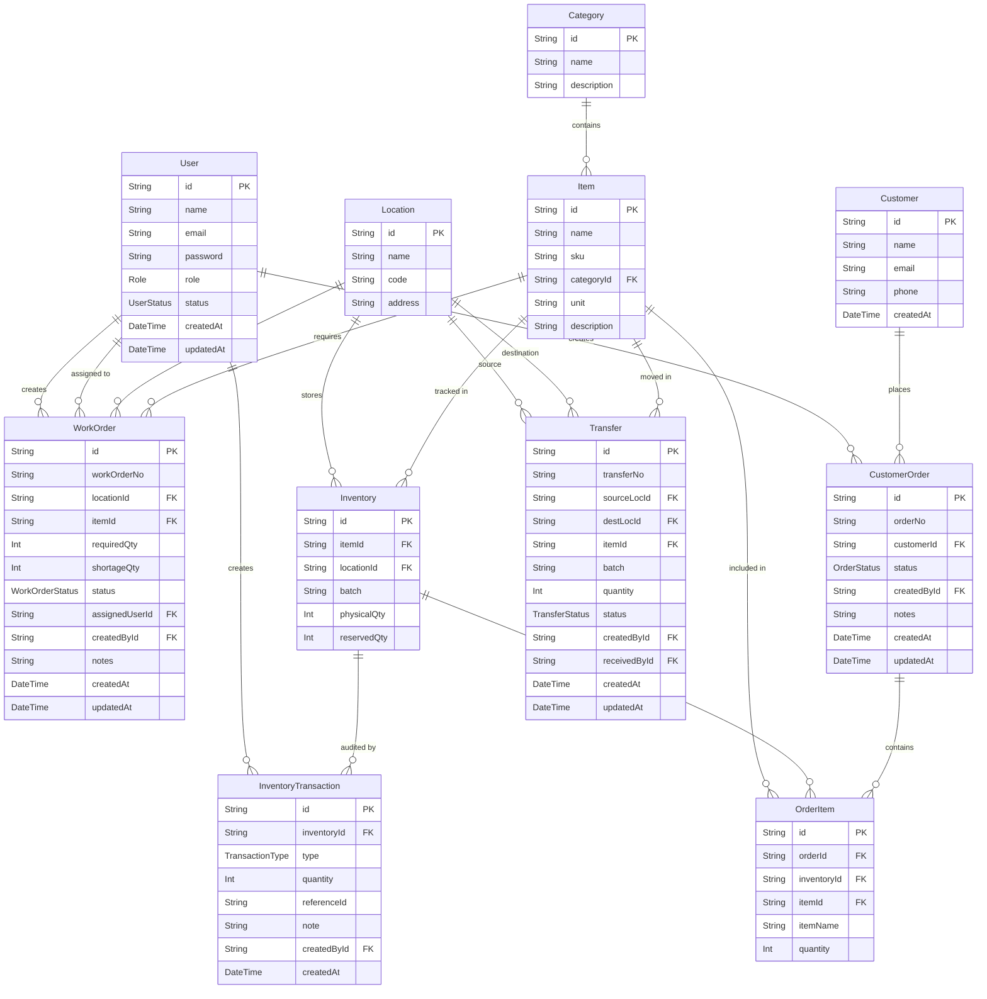

# Entity-Relationship Diagram

This document contains the Entity-Relationship (ER) diagram for the Fundsroom Mini Operations ERP, automatically mapping the Prisma database schema.

```mermaid
erDiagram
    User ||--o{ WorkOrder : "creates"
    User ||--o{ WorkOrder : "assigned to"
    User ||--o{ InventoryTransaction : "creates"
    User ||--o{ CustomerOrder : "creates"

    Category ||--o{ Item : "contains"

    Location ||--o{ Inventory : "stores"
    Location ||--o{ WorkOrder : "site for"
    Location ||--o{ Transfer : "source"
    Location ||--o{ Transfer : "destination"

    Item ||--o{ Inventory : "tracked in"
    Item ||--o{ WorkOrder : "requires"
    Item ||--o{ Transfer : "moved in"
    Item ||--o{ OrderItem : "included in"

    Inventory ||--o{ InventoryTransaction : "audited by"
    Inventory ||--o{ OrderItem : "reserved for"

    Customer ||--o{ CustomerOrder : "places"
    CustomerOrder ||--o{ OrderItem : "contains"

    %% Table Definitions
    User {
        String id PK
        String name
        String email
        String password
        Role role
        UserStatus status
        DateTime createdAt
        DateTime updatedAt
    }

    Category {
        String id PK
        String name
        String description
    }

    Location {
        String id PK
        String name
        String code
        String address
    }

    Item {
        String id PK
        String name
        String sku
        String categoryId FK
        String unit
        String description
    }

    Inventory {
        String id PK
        String itemId FK
        String locationId FK
        String batch
        Int physicalQty
        Int reservedQty
    }

    InventoryTransaction {
        String id PK
        String inventoryId FK
        TransactionType type
        Int quantity
        String referenceId
        String note
        String createdById FK
        DateTime createdAt
    }

    WorkOrder {
        String id PK
        String workOrderNo
        String locationId FK
        String itemId FK
        Int requiredQty
        Int shortageQty
        WorkOrderStatus status
        String assignedUserId FK
        String createdById FK
        String notes
        DateTime createdAt
        DateTime updatedAt
    }

    Transfer {
        String id PK
        String transferNo
        String sourceLocId FK
        String destLocId FK
        String itemId FK
        String batch
        Int quantity
        TransferStatus status
        String createdById FK
        String receivedById FK
        DateTime createdAt
        DateTime updatedAt
    }

    Customer {
        String id PK
        String name
        String email
        String phone
        DateTime createdAt
    }

    CustomerOrder {
        String id PK
        String orderNo
        String customerId FK
        OrderStatus status
        String createdById FK
        String notes
        DateTime createdAt
        DateTime updatedAt
    }

    OrderItem {
        String id PK
        String orderId FK
        String inventoryId FK
        String itemId FK
        String itemName
        Int quantity
    }
```
